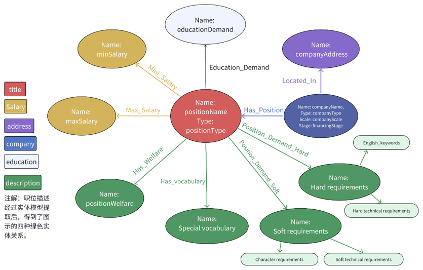
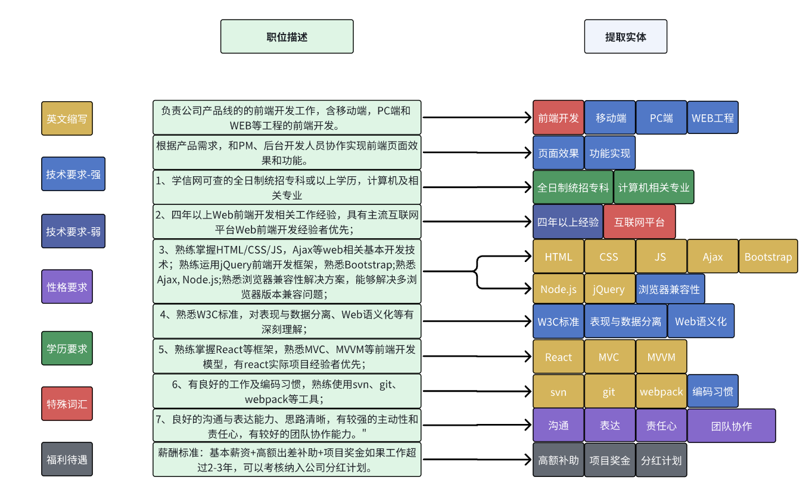

# Repository for JOB HUNTER

## Four major problems in current job-hunting platforms
- information overload (users often feel confused and fatigued about this)
- single functions (lack of practical training)
- lack of personalized services (job seekers cannot find suitable positions and employers cannot recruit suitable candidates)
- poor user experience (cumbersome functions)

## Overall Architecture
- The project adopts the B/S architecture and supports users to access the Job Hunter system based on Web browsers across platforms.

## Architecture for Frontend
- The frontend utilizes Vue's MVVM model to achieve the separation of views and models:

## Architecture for Deployment
In the actual deployment of the production environment, based on Kubernetes technology, we use a high-performance server as the Master control node, and the other two cloud servers as the slave control nodes (Worker-Node1 and Worker-Node2), among which Node1 is used as the front-end service deployment node. Node2 serves as the backend Service and database server Deployment node. It uses a central node architecture (HDFS) to separately deploy various services (achieving access exposure from deployment creation to Service), achieving a load balancing effect. It also combines redis caching technology to effectively handle high concurrency scenarios such as thousand-person tests:

## Architecture for Alogorithm
Here, we present the architecture of the virtual interview model:

## Let't examine the impressive effects!:

🔥[Click here to watch the final demonstration video of Job Hunter!](https://vimeo.com/1082929609)

# Rec Algorithm Details:

## Graph-Based Rec:
Here, we present a partial diagram of the knowledge graph design, namely the most important position nodes among them, as well as their attributes and the related nodes:

We set up seven types of entities and extracted them in the job description. For each entity, we designed different processing methods. Finally, we uniformly calculate the matching degree and make recommendations:

