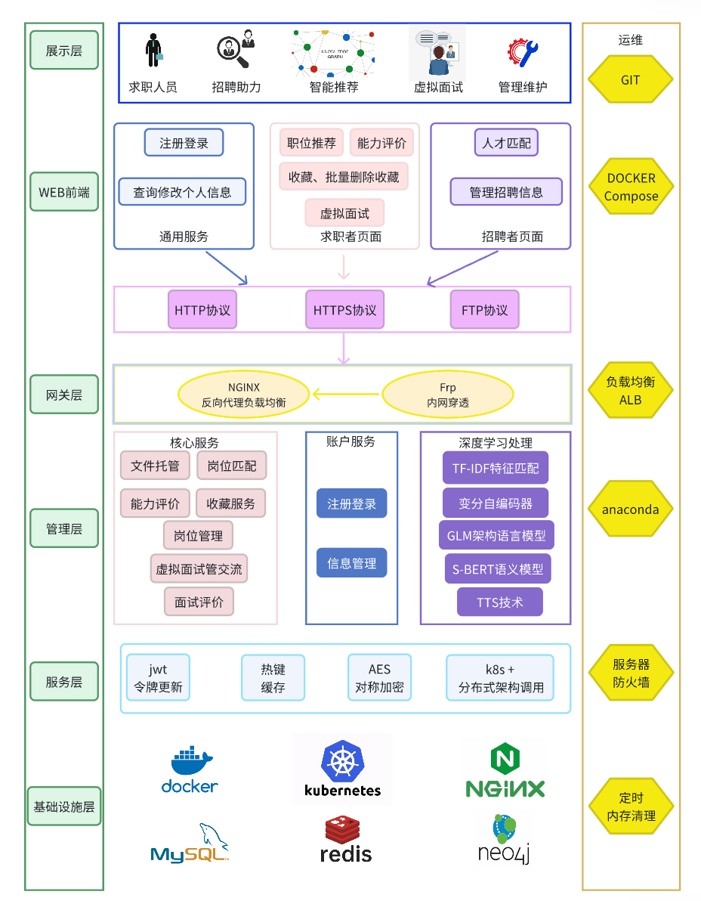
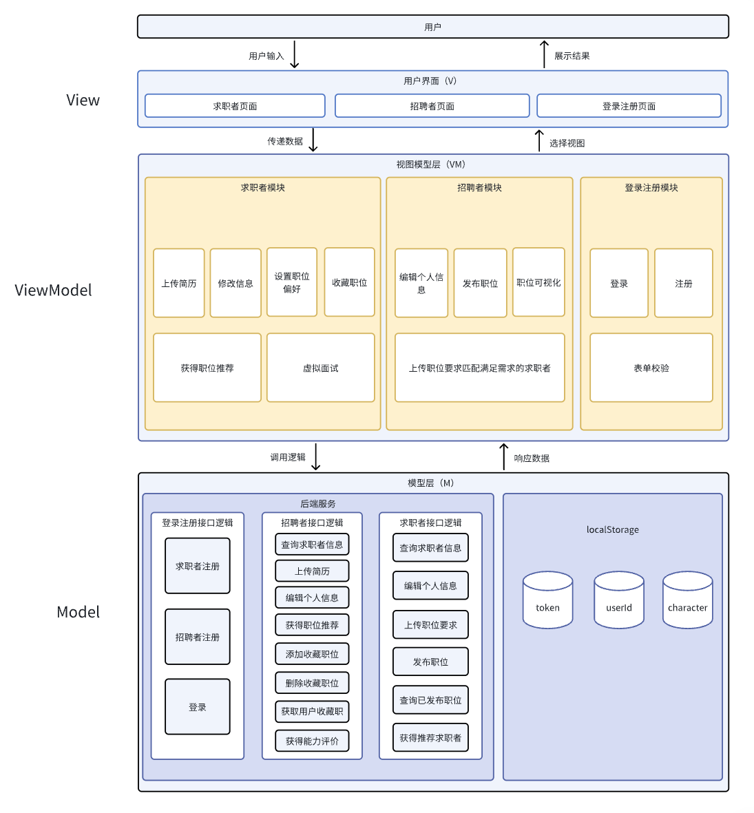
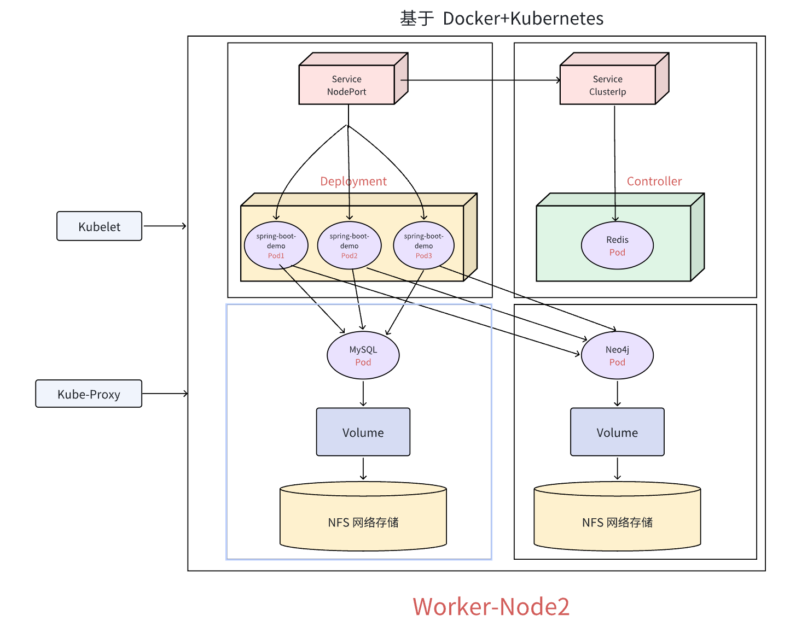
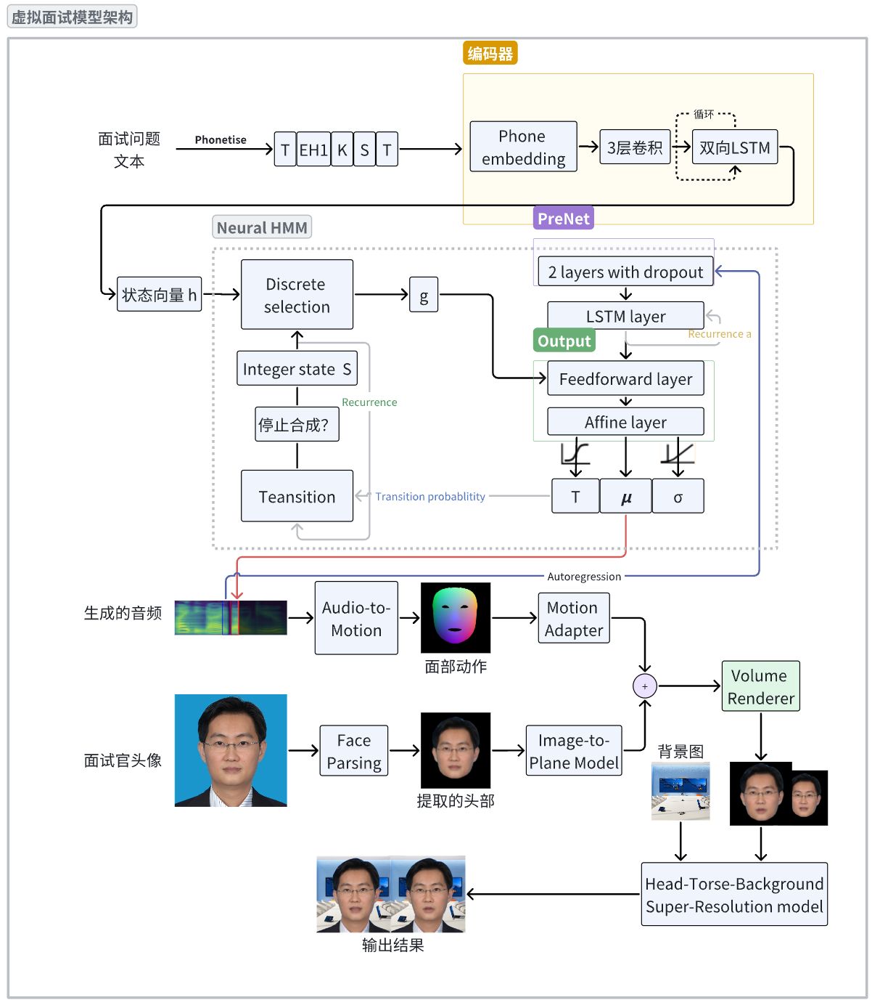

# Repository for JOB HUNTER

## Four major problems in current job-hunting platforms
- information overload (users often feel confused and fatigued about this)
- single functions (lack of practical training)
- lack of personalized services (job seekers cannot find suitable positions and employers cannot recruit suitable candidates)
- poor user experience (cumbersome functions)

## Overall Architecture
- The project adopts the B/S architecture and supports users to access the Job Hunter system based on Web browsers across platforms.

## Architecture for Frontend
- The frontend utilizes Vue's MVVM model to achieve the separation of views and models:

## Architecture for Deployment
In the actual deployment of the production environment, based on Kubernetes technology, we use a high-performance server as the Master control node, and the other two cloud servers as the slave control nodes (Worker-Node1 and Worker-Node2), among which Node1 is used as the front-end service deployment node. Node2 serves as the backend Service and database server Deployment node. It uses a central node architecture (HDFS) to separately deploy various services (achieving access exposure from deployment creation to Service), achieving a load balancing effect. It also combines redis caching technology to effectively handle high concurrency scenarios such as thousand-person tests:

## Architecture for Alogorithm
Here, we present the architecture of the virtual interview model:

## Let't examine the impressive effects!:

<iframe src="https://player.vimeo.com/video/1082929609?h=84c4f7c9cf&amp;badge=0&amp;autopause=0&amp;player_id=0&amp;app_id=58479" frameborder="0" allow="autoplay; fullscreen; picture-in-picture; clipboard-write; encrypted-media" style="position:absolute;top:0;left:0;width:100%;height:100%;" title="Job Hunter决赛演示视频"></iframe>

